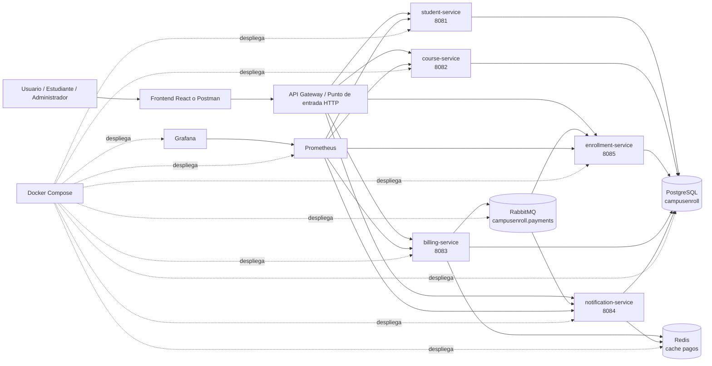
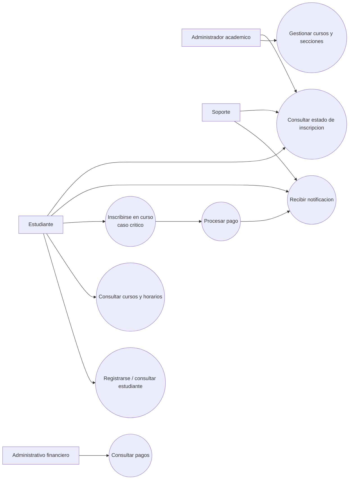
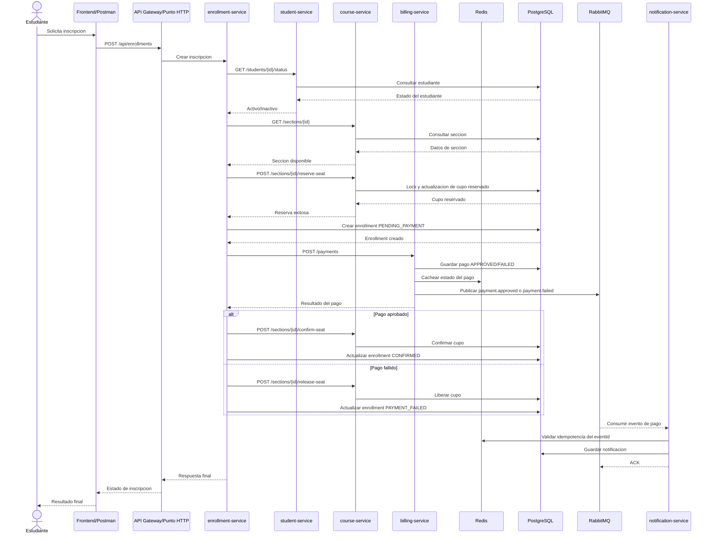
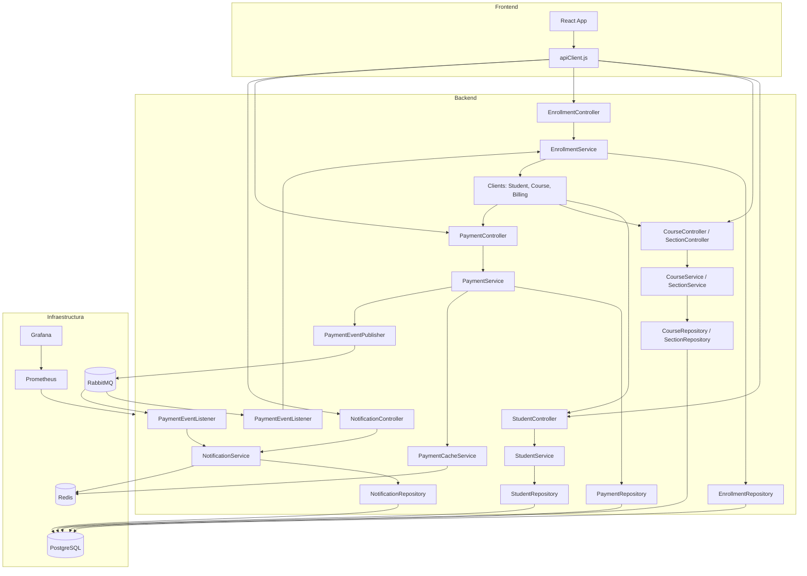
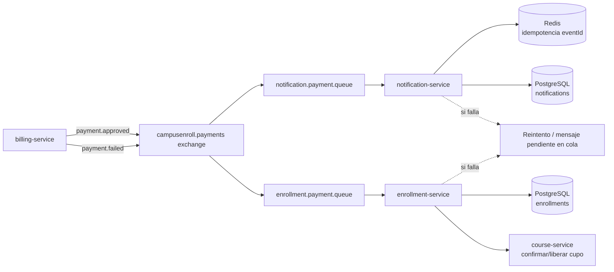
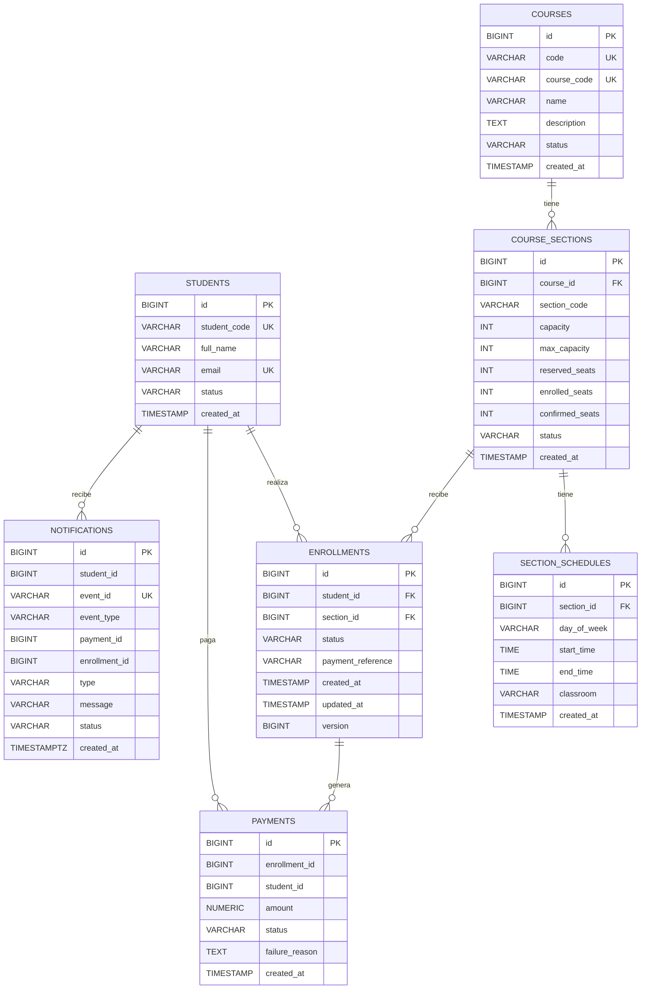

# Entrega de revision - CampusEnroll HA

## 2. Dominio asignado y contexto del problema

**Propuesta asignada:** sistema de inscripcion universitaria de cursos, llamado **CampusEnroll HA**.

La aplicacion resuelve el problema de administrar inscripciones academicas en un entorno con cupos limitados, pagos asociados y notificaciones al estudiante. El sistema permite registrar estudiantes, administrar cursos y secciones, reservar cupos, procesar pagos y notificar el resultado de la operacion.

**Problema que resuelve:** evita procesos manuales de inscripcion, duplicidad de registros, sobreventa de cupos, falta de trazabilidad de pagos y falta de notificaciones confiables.

**Usuarios principales:**

- Estudiantes que desean inscribirse en cursos.
- Administradores academicos que gestionan cursos, secciones y cupos.
- Personal administrativo/financiero que consulta pagos.
- Soporte tecnico o academico que revisa estados de inscripcion y notificaciones.

**Operacion mas critica:** la inscripcion de un estudiante a una seccion con cupo limitado, incluyendo reserva de cupo, creacion de inscripcion, procesamiento de pago, confirmacion o liberacion del cupo y notificacion final.

**Que podria salir mal si el sistema falla:**

- Se pueden sobrevender cupos de una seccion.
- Un estudiante podria quedar inscrito dos veces en la misma seccion.
- Se podria confirmar una inscripcion aunque el pago falle.
- Se podria cobrar un pago sin confirmar la inscripcion.
- Se podrian perder notificaciones o eventos pendientes.
- El sistema podria mostrar estados inconsistentes entre pagos, cupos e inscripciones.

## 3. Estado actual del proyecto

**Funcionalidades ya implementadas:**

- Frontend React con pantallas para dashboard, estudiantes, cursos, inscripciones, pagos y notificaciones.
- Registro y consulta de estudiantes.
- Gestion de cursos, secciones y horarios.
- Reserva, liberacion y confirmacion de cupos por seccion.
- Creacion y consulta de pagos.
- Cache de estado de pagos en Redis.
- Publicacion de eventos de pago aprobado o fallido en RabbitMQ.
- Consumo de eventos de pago desde notification-service.
- Registro de notificaciones en PostgreSQL.
- Idempotencia de eventos de notificacion usando Redis.
- Infraestructura base con Docker Compose.
- Monitoreo base con Prometheus y Grafana.
- Script k6 inicial para pruebas de carga sobre billing-service.

**Microservicios creados:**

- `student-service`: estudiantes y estado academico.
- `course-service`: cursos, secciones, horarios y cupos.
- `enrollment-service`: orquestacion del flujo de inscripcion.
- `billing-service`: pagos, cache Redis y publicacion de eventos.
- `notification-service`: consumo de eventos y notificaciones.

**Endpoints disponibles:**

Student service:

- `GET /health`
- `GET /students`
- `GET /students/{id}`
- `POST /students`
- `PUT /students/{id}`
- `DELETE /students/{id}`
- `GET /students/{id}/status`
- `PATCH /students/{id}/status`
- Tambien expone rutas bajo `/api/students`.

Course service:

- `GET /health`
- `POST /courses`
- `GET /courses`
- `GET /courses/{id}`
- `POST /sections`
- `GET /sections`
- `GET /sections/{id}`
- `GET /sections/{id}/schedule`
- `POST /sections/{id}/reserve-seat`
- `POST /sections/{id}/release-seat`
- `POST /sections/{id}/confirm-seat`

Enrollment service:

- `GET /health`
- `POST /api/enrollments`
- `GET /api/enrollments`
- `GET /api/enrollments/{id}`
- `GET /api/students/{studentId}/enrollments`
- `DELETE /api/enrollments/{id}`

Billing service:

- `GET /health`
- `POST /payments`
- `GET /payments`
- `GET /payments/{id}`
- `GET /payments/{id}/cache-status`

Notification service:

- `GET /health`
- `GET /notifications`
- `GET /students/{studentId}/notifications`
- `PATCH /notifications/{id}/read`

**Base de datos creada:**

- Motor: PostgreSQL 16.
- Base de datos: `campusenroll`.
- Schema: `campusenroll`.
- Migraciones Flyway en `campusenroll-ha/database/migrations`.
- Tablas principales: `students`, `courses`, `course_sections`, `section_schedules`, `enrollments`, `payments`, `notifications`.

**Contenedores configurados:**

- `campusenroll-postgres`
- `campusenroll-redis`
- `campusenroll-rabbitmq`
- `campusenroll-prometheus`
- `campusenroll-grafana`
- `billing-service`
- `notification-service`
- `student-service` bajo profile `future`
- `course-service` bajo profile `future`
- `enrollment-service` bajo profile `future`
- `k6` bajo profile `testing`

**Servicios pendientes o parciales:**

- Integracion completa del flujo end-to-end entre frontend, gateway/punto de entrada y todos los microservicios.
- Homologacion final de `student-service`, `course-service` y `enrollment-service` dentro del Compose principal.
- API Gateway formal. Actualmente el punto de entrada puede ser el frontend o llamadas directas por puerto/Postman.
- Pruebas integradas automatizadas del flujo completo.
- Hardening de alta disponibilidad real con replicas, health checks y balanceo.

**Riesgos tecnicos identificados:**

- `enrollment-service` tiene estructura de carpetas anidada, lo que dificulta mantenimiento.
- Algunos servicios estan marcados en Docker Compose como `future`, por lo que no forman parte del despliegue base.
- No existe todavia un API Gateway unico.
- La publicacion de eventos ocurre despues de guardar pago, pero falta implementar formalmente Outbox Pattern para garantizar entrega ante fallos intermedios.
- Si Redis se reinicia, se pierden caches temporales e idempotencia temporal.
- Si RabbitMQ no esta disponible, se afecta la entrega asincrona de notificaciones.

## 4. Reglas criticas de negocio

1. No se debe inscribir a un estudiante inactivo o bloqueado.
2. No se debe permitir mas de una inscripcion activa del mismo estudiante en la misma seccion.
3. No se debe superar la capacidad maxima de una seccion.
4. No se debe confirmar una inscripcion si el pago fue rechazado.
5. Si el pago falla, el cupo reservado debe liberarse.
6. No se debe permitir traslape de horarios entre cursos activos del mismo estudiante.
7. No se deben procesar dos veces los mismos eventos de pago.
8. No se deben perder eventos de pago aprobado o fallido.
9. No se deben permitir estados invalidos dentro del flujo de inscripcion.
10. Todo pago debe quedar persistido con estado `APPROVED` o `FAILED`.

## 5. Diagrama de arquitectura

## 6. Diagrama de casos de uso

Caso de uso critico evaluado: **inscribirse en curso con validacion de cupo, pago y notificacion**.

## 7. Diagrama de secuencia del caso critico

## 8. Diagrama de componentes

## 9. Diagrama de flujo de eventos

**Eventos publicados:**

- `payment.approved`: producido por `billing-service`; consumido por `notification-service` y `enrollment-service`; indica que el pago fue aprobado.
- `payment.failed`: producido por `billing-service`; consumido por `notification-service` y `enrollment-service`; indica que el pago fue rechazado.

**Canal:** exchange RabbitMQ `campusenroll.payments` con routing keys `payment.approved` y `payment.failed`.

**Accion del consumidor:**

- `notification-service`: valida idempotencia en Redis y crea notificacion en PostgreSQL.
- `enrollment-service`: confirma la inscripcion y cupo si el pago fue aprobado, o libera cupo y marca fallo si el pago fue rechazado.

**Si el consumidor falla:** RabbitMQ conserva el mensaje mientras no exista ACK exitoso. El consumidor puede reintentar al reiniciarse. Para robustez final se recomienda configurar DLQ, reintentos con backoff y alertas en Prometheus/Grafana.

## 10. Modelo entidad-relacion

**Restricciones e indices importantes:**

- `students.student_code` unico.
- `students.email` unico.
- `courses.course_code` unico.
- `courses.code` unico.
- `course_sections(course_id, section_code)` unico.
- `enrollments(student_id, section_id)` unico.
- `notifications.event_id` unico.
- Check `payments.amount > 0`.
- Check de horario `section_schedules.start_time < section_schedules.end_time`.
- Check de capacidad para que reservados + confirmados no superen la capacidad.
- Indices en email, estados, cursos, secciones, inscripciones por estudiante/seccion, pagos por estudiante/enrollment y notificaciones por estudiante/evento.

## 11. Estrategia de consistencia

- **Transacciones:** operaciones de pago, reserva, confirmacion y actualizacion de inscripcion deben ejecutarse dentro de transacciones locales por servicio.
- **Restricciones unicas:** evitan estudiantes duplicados, cursos duplicados, inscripciones duplicadas y eventos de notificacion duplicados.
- **Locks logicos o de negocio:** `course-service` usa bloqueo al consultar seccion para actualizar cupos y evitar condiciones de carrera.
- **Control de estados:** la inscripcion debe pasar por estados validos como `PENDING_PAYMENT`, `CONFIRMED` y `PAYMENT_FAILED`.
- **Integridad pago-inscripcion:** billing solo registra pagos para una inscripcion existente del mismo estudiante en estado `PENDING_PAYMENT`; los resultados repetidos son idempotentes y los contradictorios se rechazan.
- **Idempotencia:** `notification-service` usa Redis y `event_id` unico para no procesar el mismo evento dos veces.
- **Sagas:** el flujo de inscripcion actua como saga: reservar cupo, crear inscripcion, procesar pago, confirmar o compensar.
- **Compensaciones:** si el pago falla o ocurre un error, el cupo reservado se libera.
- **Outbox Pattern:** recomendado como mejora final para guardar evento y cambio de pago en la misma transaccion, y publicar el evento desde una tabla outbox para no perder eventos si RabbitMQ falla despues de guardar el pago.

## 12. Estrategia de alta disponibilidad

- `billing-service`, `notification-service`, `student-service`, `course-service` y `enrollment-service` deben poder ejecutarse con replicas.
- Si cae un contenedor de microservicio, Docker Compose lo reinicia por `restart: unless-stopped`.
- Si cae una replica, el trafico debe dirigirse a otra replica mediante API Gateway o balanceador.
- Si Redis se reinicia, el sistema pierde cache temporal, pero PostgreSQL sigue siendo la fuente de verdad. Se puede regenerar cache consultando la base de datos.
- Si un consumidor de eventos se detiene, RabbitMQ conserva eventos no confirmados y el consumidor puede continuar al reiniciarse.
- Si `notification-service` falla, el negocio principal puede continuar, pero las notificaciones quedan pendientes.
- Si Redis falla, se degrada cache/idempotencia temporal, pero se puede seguir consultando PostgreSQL.
- Si Prometheus o Grafana fallan, se pierde visibilidad temporal, pero no se detiene el negocio.
- Para una entrega final mas robusta se recomienda agregar health checks, replicas por servicio, DLQ en RabbitMQ y backup/restore validado de PostgreSQL.

## 13. Estrategia de cache

**Redis se usara para:**

- Estado temporal de pagos: `billing:payment:{paymentId}:status`.
- Idempotencia de eventos de notificacion: `notification:event:{eventId}`.
- Opcionalmente, consultas frecuentes de catalogo de cursos/secciones activas.

**Justificacion:**

- Reducir lecturas repetidas a PostgreSQL.
- Responder rapido al consultar estado de pagos recientes.
- Evitar reprocesamiento de eventos duplicados.
- Mantener datos temporales que no requieren persistencia permanente.

**TTL estimado:**

- Estado de pago: 15 a 30 minutos.
- Idempotencia de evento: 24 horas o mas, segun periodo de reintentos.
- Catalogo de cursos/secciones: 5 a 10 minutos.

**Invalidacion:**

- Al cambiar el estado de pago, actualizar la key correspondiente.
- Al modificar cursos/secciones/cupos, invalidar cache de catalogo.
- Para idempotencia, dejar expirar por TTL despues de la ventana segura de reintentos.

**Riesgo de datos desactualizados:**

- Redis podria mostrar un estado anterior por algunos minutos.
- Para operaciones criticas no se debe confiar solo en cache; siempre debe validarse contra PostgreSQL y reglas de negocio del microservicio responsable.

## 14. Plan de observabilidad

**Herramientas:**

- Prometheus para recoleccion de metricas.
- Grafana para dashboards.
- Logs de contenedores Docker.
- RabbitMQ Management UI para colas, exchanges y mensajes.

**Metricas a medir:**

- Cantidad de peticiones HTTP por servicio.
- Latencia promedio.
- Latencia p95 y p99.
- Errores HTTP 4xx y 5xx.
- Uso de CPU y memoria por contenedor.
- Estado de contenedores.
- Estado de health endpoints.
- Pagos procesados correctamente.
- Pagos fallidos.
- Eventos publicados.
- Eventos procesados correctamente.
- Eventos fallidos o pendientes en RabbitMQ.
- Tamano de colas RabbitMQ.
- Conexiones activas a PostgreSQL.
- Tiempo de respuesta de PostgreSQL.
- Disponibilidad de Redis.

**Dashboards sugeridos en Grafana:**

- Salud general de servicios.
- Trafico HTTP y errores.
- Latencia de operacion critica.
- Estado de RabbitMQ.
- Estado de PostgreSQL.
- Uso de recursos por contenedor.
- Pagos e inscripciones por estado.

## 15. Plan de pruebas finales

**Herramienta de prueba:** k6.

**Escenario de 50,000 peticiones:**

- Ejecutar pruebas contra `POST /payments` o contra `POST /api/enrollments` cuando el flujo completo este integrado.
- Configurar k6 con etapas de carga hasta alcanzar al menos 50,000 solicitudes totales.
- Validar codigos HTTP esperados, tiempos de respuesta y porcentaje de errores.

**Escenario de concurrencia sobre operacion critica:**

- Crear una seccion con cupo limitado.
- Lanzar muchos usuarios concurrentes intentando inscribirse en la misma seccion.
- Resultado esperado: no debe superarse `max_capacity`; las solicitudes excedentes deben fallar con error de negocio controlado.

**Escenario de caida de contenedor o pod:**

- Durante la prueba, detener `notification-service`.
- Verificar que RabbitMQ conserve eventos pendientes.
- Reiniciar `notification-service`.
- Confirmar que los eventos pendientes se procesan sin duplicar notificaciones.

**Metricas a capturar:**

- Total de requests.
- Throughput por segundo.
- Latencia promedio, p95 y p99.
- Porcentaje de errores.
- CPU y memoria por contenedor.
- Conexiones activas a PostgreSQL.
- Eventos publicados, pendientes y procesados.
- Tamano de colas RabbitMQ.
- Uso de Redis.

**Resultado esperado:**

- El sistema procesa 50,000 peticiones sin caidas generales.
- La operacion critica mantiene consistencia bajo concurrencia.
- No hay sobreventa de cupos.
- No hay inscripciones duplicadas.
- Los pagos aprobados generan confirmacion y notificacion.
- Los pagos fallidos liberan cupo y generan notificacion de fallo.
- Si un consumidor cae, los eventos se conservan y se procesan al volver el servicio.
