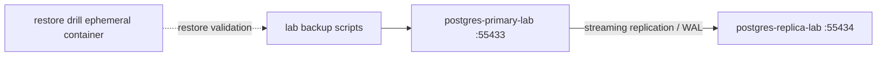

# PostgreSQL HA Lab Guide

This guide describes the isolated PostgreSQL primary/replica laboratory for CampusEnroll-HA. It is not production HA and it does not replace the current local database container `campusenroll-postgres`.

Every script in this guide is lab-only. Do not use these commands as production HA operations.

## Scope

Implemented for lab:

- Separate Compose file: `docker-compose.postgres-ha-lab.yml`.
- Primary container: `postgres-primary-lab`.
- Replica container: `postgres-replica-lab`.
- Separate ports:
  - primary: `55433:5432`
  - replica: `55434:5432`
- Separate named volumes:
  - `campusenroll_postgres_primary_lab_data`
  - `campusenroll_postgres_replica_lab_data`
  - `campusenroll_postgres_primary_lab_wal_archive`
- Separate network: `campusenroll_postgres_ha_lab_net`.

Not implemented:

- Automatic failover.
- Patroni, etcd, Consul, PgBouncer, Kubernetes, or Docker Swarm.
- Application read/write routing.
- Production-grade backup storage, encryption, PITR automation, or alerting.

## Safety Rules

- Do not run `docker compose down -v`.
- Do not delete `campusenroll-ha_campusenroll_pg_data`.
- Do not point write-heavy services at the replica.
- Do not treat promotion as reversible. After promotion, rebuild replication topology.
- Cleanup of lab volumes, if ever added, must require an explicit `-ConfirmDestroyLab`-style flag and must only target lab volumes.
- Scripts that remove containers or volumes print the allowlisted lab resources before acting.
- `postgres-ha-lab-promote-replica.ps1` refuses to stop the primary if `postgres-replica-lab` is not running.

## Lab Variables

Defaults are in `.env.postgres-ha-lab.example`:

```env
POSTGRES_LAB_DB=campusenroll_lab
POSTGRES_LAB_USER=campus_lab
POSTGRES_LAB_PASSWORD=campus_lab123
POSTGRES_LAB_REPLICATION_USER=replicator_lab
POSTGRES_LAB_REPLICATION_PASSWORD=replicator_lab123
POSTGRES_LAB_PRIMARY_PORT=55433
POSTGRES_LAB_REPLICA_PORT=55434
```

These are lab credentials only.

## Architecture



## How Replication Works

The primary starts PostgreSQL 16 with:

- `wal_level=replica`
- `max_wal_senders=10`
- `max_replication_slots=10`
- `hot_standby=on`
- `listen_addresses=*`

The primary init script `database/postgres-ha-lab/primary/init/01-configure-replication.sh`:

- Adds lab replication access to `pg_hba.conf`.
- Creates or updates the replication user.

The replica bootstraps itself only when its data directory is empty:

```bash
pg_basebackup -h postgres-primary-lab -p 5432 -D "$PGDATA" -U "$POSTGRES_REPLICATION_USER" -Fp -Xs -P -R
```

`-R` writes the standby configuration needed for PostgreSQL 16 to follow the primary.

## Start the Lab

```powershell
cd campusenroll-ha
powershell -ExecutionPolicy Bypass -File .\database\scripts\postgres-ha-lab-up.ps1
```

Equivalent direct command for a fresh, non-promoted lab:

```powershell
docker compose -f docker-compose.postgres-ha-lab.yml up -d postgres-primary-lab postgres-replica-lab
```

Prefer the script because it detects a promoted replica and refuses to restart the old primary accidentally.

## Status

```powershell
powershell -ExecutionPolicy Bypass -File .\database\scripts\postgres-ha-lab-status.ps1
```

## Validate Primary and Replica

```powershell
docker exec postgres-primary-lab psql -U campus_lab -d campusenroll_lab -tAc "SELECT pg_is_in_recovery();"
docker exec postgres-replica-lab psql -U campus_lab -d campusenroll_lab -tAc "SELECT pg_is_in_recovery();"
```

Expected:

- Primary: `f`
- Replica: `t`

Primary replication state:

```powershell
docker exec postgres-primary-lab psql -U campus_lab -d campusenroll_lab -c "SELECT application_name, state, sync_state, write_lag, flush_lag, replay_lag FROM pg_stat_replication;"
```

## Basic Replication Test

```powershell
powershell -ExecutionPolicy Bypass -File .\database\scripts\postgres-ha-lab-check-replication.ps1
```

This script:

- Confirms primary is not in recovery.
- Confirms replica is in recovery.
- Shows `pg_stat_replication`.
- Creates `ha_lab.replication_probe` on the primary.
- Inserts one generated probe row on the primary.
- Reads the probe row from the replica.
- Confirms a write attempted on the replica fails.

The table and rows are lab-only and do not use real CampusEnroll data.

## Manual Promotion Test

Promotion is destructive to the lab topology because the replica becomes writable and no longer follows the old primary.

```powershell
powershell -ExecutionPolicy Bypass -File .\database\scripts\postgres-ha-lab-promote-replica.ps1 -ConfirmPromoteLab
```

The script:

- Stops `postgres-primary-lab`.
- Promotes `postgres-replica-lab` with `SELECT pg_promote(true, 60);`.
- Waits until `pg_is_in_recovery()` returns `false`.
- Creates a small write probe on the promoted replica.

After this test, the original topology is broken. To get primary/replica again, rebuild the lab replica from the desired primary. Do not reconnect the old primary as primary without a deliberate rebuild plan. The `postgres-ha-lab-up.ps1` script refuses to restart the old primary if it detects that the replica was already promoted, unless `-AllowStartAfterPromotion` is passed deliberately.

To reset this isolated lab from scratch, use the explicit lab-only reset script:

```powershell
powershell -ExecutionPolicy Bypass -File .\database\scripts\postgres-ha-lab-reset.ps1 -ConfirmDestroyLab
powershell -ExecutionPolicy Bypass -File .\database\scripts\postgres-ha-lab-up.ps1
```

The reset script removes only allowlisted lab containers and volumes. It does not use `docker compose down -v` and does not target `campusenroll-postgres` or `campusenroll-ha_campusenroll_pg_data`.

Resources removed by reset/rebuild scripts are limited to:

- Containers: `postgres-primary-lab`, `postgres-replica-lab`, `postgres-restore-drill-lab`.
- Volumes: `campusenroll_postgres_primary_lab_data`, `campusenroll_postgres_replica_lab_data`, `campusenroll_postgres_primary_lab_wal_archive`.

## Post-Promotion Recovery

Detailed runbook: `docs/postgresql-ha-lab-post-promotion.md`.

Preferred lab recovery after promotion:

```powershell
powershell -ExecutionPolicy Bypass -File .\database\scripts\postgres-ha-lab-rebuild-replica-after-promotion.ps1 -ConfirmDestroyLab
powershell -ExecutionPolicy Bypass -File .\database\scripts\postgres-ha-lab-check-replication.ps1
```

The rebuild script preserves promoted lab data when `postgres-replica-lab` is still running and promoted. If the promoted container is absent, it rebuilds a fresh empty primary/replica lab and reports that fallback.

## Backup and Restore Drill

Create a lab backup from primary:

```powershell
powershell -ExecutionPolicy Bypass -File .\database\scripts\postgres-ha-lab-backup.ps1
```

Restore into an ephemeral drill container:

```powershell
powershell -ExecutionPolicy Bypass -File .\database\scripts\postgres-ha-lab-restore-drill.ps1 -BackupFile .\database\postgres-ha-lab\backups\<file>.dump -ConfirmRestoreDrill
```

The restore drill container has no named volume and is stopped/removed at the end.

## Future Microservice Integration

Do not change services automatically in this phase.

To point services at the lab primary in a future experiment:

```env
DB_HOST=<host-running-lab-primary>
DB_PORT=55433
DB_NAME=campusenroll_lab
DB_USER=campus_lab
DB_PASSWORD=campus_lab123
```

Write paths must use primary:

- enrollment creation/status changes
- course seat reservation/confirmation/release
- payment persistence
- notification persistence/idempotency

Potential future replica reads:

- dashboards
- reports
- historical/non-critical list endpoints

Risks:

- Replica reads can be stale.
- Read-after-write consistency is not guaranteed.
- Current services have one datasource each; read/write routing requires application configuration changes or a routing datasource.

## Lab RPO/RTO

Estimated lab goals after validation:

- RPO: seconds to under a minute for streaming replication under light load, but async replication can still lose recent WAL.
- RTO: manual promotion in a few minutes once the operator confirms primary failure.

These are lab observations, not production guarantees.

## Production Gap

Still missing for real HA:

- Automatic failover with fencing.
- Split-brain prevention.
- Tested PITR with durable WAL archive outside the host.
- Monitoring and alerts.
- Secure secrets management.
- TLS and network restrictions.
- Application-level read/write separation.
